# Offline Tile Server Architecture Documentation
[](LICENSE)
[](https://github.com/maptiler/tileserver-gl)
[](https://www.docker.com/)
[](https://openmaptiles.org/)
[](https://www.openstreetmap.org/)
[]()
[]()
[]()

> **Self-hosted, offline-capable tile server for serving OpenStreetMap vector and raster tiles**  
## Table of Contents

### Core Documentation
1. [Overview](#overview)
2. [System Architecture](#system-architecture)
3. [Directory Structure](#directory-structure)
4. [Core Components](#core-components)
   - [TileServer-GL Container](#1-tileserver-gl-container)
   - [MBTiles Database](#2-mbtiles-database)
   - [Style Configuration](#3-style-configuration)
   - [Font Resources](#4-font-resources)
   - [Configuration Management](#5-configuration-management)
5. [API Endpoints](#api-endpoints)
6. [Client Integration Examples](#client-integration-examples)
7. [Deployment](#deployment)
8. [Performance Characteristics](#performance-characteristics)
9. [Scalability Considerations](#scalability-considerations)
10. [Security Considerations](#security-considerations)
11. [Monitoring and Maintenance](#monitoring-and-maintenance)
12. [Troubleshooting](#troubleshooting)
13. [Updating Data](#updating-data)
14. [Comparison: Vector vs Raster](#comparison-vector-vs-raster)
15. [System Requirements](#system-requirements)
16. [License and Attribution](#license-and-attribution)
17. [Conclusion](#conclusion)

### Appendices
- [Appendix A: Generating MBTiles with Tilemaker](#appendix-a-generating-mbtiles-with-tilemaker)

---

## Overview

This document describes a self-hosted, offline-capable tile server architecture using TileServer-GL to serve both vector and raster tiles from OpenStreetMap data. The system is designed to provide map services for Texas region without requiring internet connectivity.

[↑ Back to Top](#table-of-contents)

---

## System Architecture

### Components Stack

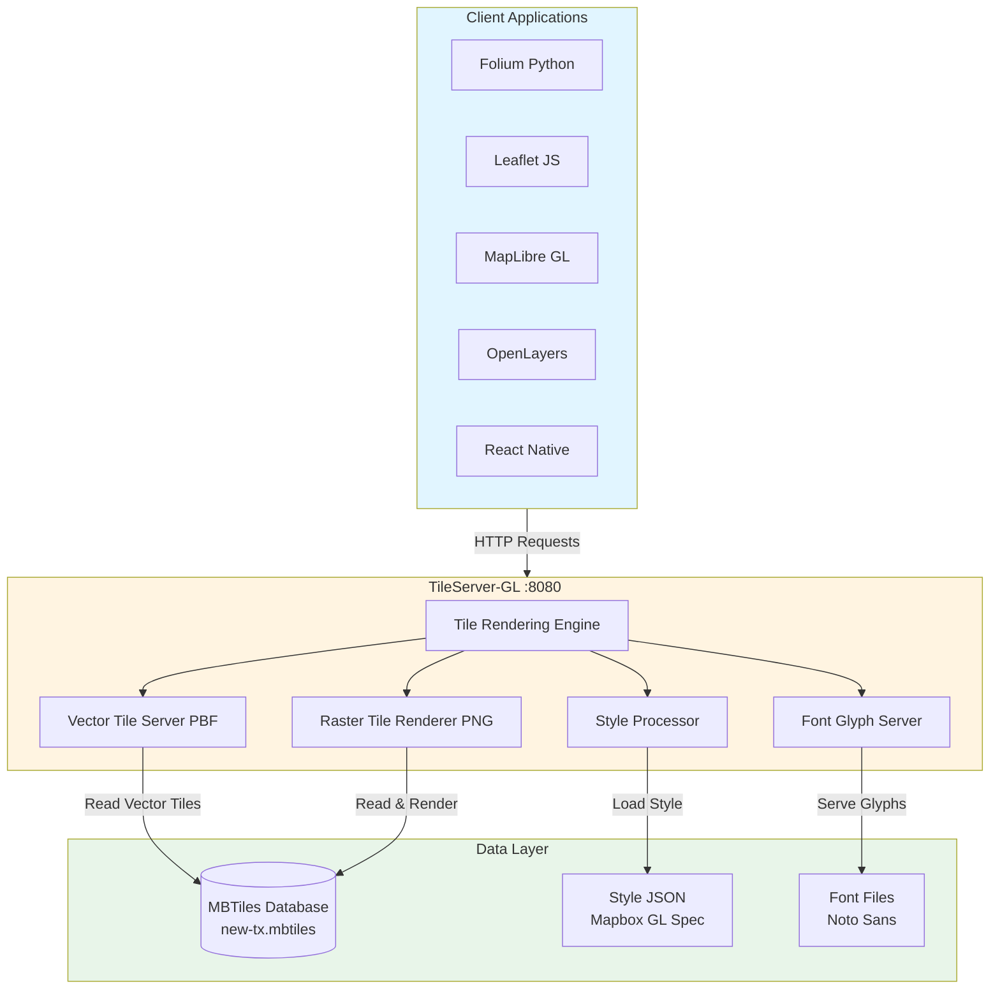

[↑ Back to Top](#table-of-contents)

---

## Directory Structure

```
/data/
├── config.json              # TileServer-GL configuration
├── fonts/                   # Font glyphs for text rendering
│   ├── Noto Sans Regular/
│   ├── Noto Sans Italic/
│   ├── Noto Sans Medium/
│   ├── Noto Sans Semibold/
│   ├── Noto Sans Devanagari Regular v1/
│   └── OFL.txt             # Open Font License
├── new-tx.mbtiles          # Vector tiles database (OpenMapTiles schema)
├── style.json              # Mapbox GL Style specification
└── texas-latest.osm.pbf    # Source OSM data (optional, for reference)
```

[↑ Back to Top](#table-of-contents)

---

## Core Components

### 1. TileServer-GL Container

**Technology**: Docker container running `maptiler/tileserver-gl`

**Purpose**: HTTP server that:
- Serves vector tiles in PBF (Protocol Buffer) format
- Renders raster tiles in PNG format on-demand
- Processes Mapbox GL style specifications
- Serves font glyphs for map labels

**Configuration**:
```yaml
Container: tileserver-gl
Image: maptiler/tileserver-gl
Ports: 8080:8080
Network: Host IP YOUR-SERVER
```

**Command-line Options**:
```bash
--mbtiles /data/new-tx.mbtiles    # Primary data source
--public_url http://YOUR-SERVER:8080  # Base URL for tile serving
--verbose                          # Detailed logging
```

**Environment**:
- CORS enabled for cross-origin requests
- User/Group ID mapping for file permissions
- Auto-restart policy (unless-stopped)

[↑ Back to Top](#table-of-contents)

---

### 2. MBTiles Database

**File**: `new-tx.mbtiles`

**Format**: SQLite-based tile storage format containing:
- Vector tiles in Protocol Buffer format
- Metadata (bounds, center, zoom levels)
- Tile index for efficient retrieval

**Schema**: OpenMapTiles v3.x compatible

**Zoom Levels**: 0-14

**Coverage**: Texas region
- **Bounds**: (-106.9125, 25.66764) to (-93.5078, 36.52618)
- **Center**: (-100.21015, 31.09691) at zoom level 7
- **Tile Format**: PBF (Protocol Buffers)

**Vector Layers** (16 layers total):

| Layer | Zoom Range | Key Fields | Description |
|-------|------------|------------|-------------|
| **place** | 0-14 | `class`, `name:latin` | Cities, towns, villages, and localities |
| **boundary** | 0-14 | _(geometry only)_ | Administrative and political boundaries |
| **poi** | 12-14 | `class`, `subclass`, `name:latin`, `indoor` | Points of interest (restaurants, shops, landmarks) |
| **housenumber** | 14 | `housenumber` | Building address numbers |
| **waterway** | 8-14 | `class`, `name:latin`, `brunnel` | Rivers, streams, canals |
| **transportation** | 4-14 | `class`, `subclass`, `surface`, `brunnel`, `access`, `bicycle`, `foot`, `horse`, `service`, `expressway`, `toll` | Roads, highways, paths, railways |
| **transportation_name** | 8-14 | `class`, `name:latin`, `ref`, `network`, `subclass` | Street and highway labels |
| **building** | 13-14 | `class`, `subclass`, `name:latin`, `render_height`, `render_min_height`, `indoor` | Building footprints with height data |
| **water** | 6-14 | `class`, `intermittent` | Lakes, ponds, reservoirs |
| **water_name** | 14 | `class`, `name:latin` | Water body labels |
| **aeroway** | 11-14 | `class`, `ref` | Runways, taxiways, aprons |
| **aerodrome_label** | 10-14 | `class`, `name:latin`, `iata`, `icao`, `ele`, `ele_ft` | Airport names and codes |
| **park** | 11-14 | `class`, `name:latin` | Parks, nature reserves, protected areas |
| **landuse** | 4-14 | `class`, `subclass`, `name:latin`, `indoor` | Residential, commercial, industrial areas |
| **landcover** | 0-14 | `class`, `subclass`, `name:latin`, `indoor` | Forest, grass, sand, rock |
| **mountain_peak** | 11-14 | `class`, `name:latin`, `ele`, `ele_ft` | Mountain summits with elevation |

**Feature Attributes by Category**:

**Transportation Features**:
- `class`: motorway, trunk, primary, secondary, tertiary, minor, service, track, path, ferry, rail
- `surface`: paved, unpaved, asphalt, concrete, gravel, dirt
- `brunnel`: bridge, tunnel, ford
- `access`: yes, no, permissive, destination, private
- `bicycle/foot/horse`: yes, no, designated, permissive
- `expressway`: boolean (true for controlled-access highways)
- `toll`: boolean (true for toll roads)

**Building Features**:
- `class`: residential, commercial, industrial, public, religious, etc.
- `render_height`: Building height in meters
- `render_min_height`: Base height in meters (for elevated structures)
- `indoor`: Boolean for indoor structures

**Place Features**:
- `class`: country, state, city, town, village, hamlet, suburb, neighbourhood, isolated_dwelling

**POI Features**:
- `class`: restaurant, cafe, fast_food, bar, fuel, hospital, school, bank, etc.
- `subclass`: Detailed categorization within class

**Water Features**:
- `class`: river, canal, stream, lake, reservoir, pond, basin
- `intermittent`: yes/no (seasonal water bodies)

**Aerodrome Features**:
- `iata`: 3-letter IATA airport code (e.g., DFW, AUS)
- `icao`: 4-letter ICAO code (e.g., KDFW, KAUS)
- `ele`: Elevation in meters
- `ele_ft`: Elevation in feet

**Data Quality Metrics**:
- Total tiles: 230,917
- Total features: ~4.1 million
- Database size: 592 MB
- Source: OpenStreetMap contributors

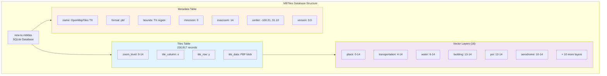

[↑ Back to Top](#table-of-contents)

---

### 3. Style Configuration

**File**: `style.json`

**Format**: Mapbox GL Style Specification v8

**Key Elements**:

**Sources**:
```json
{
  "openmaptiles": {
    "type": "vector",
    "tiles": ["http://localhost:8080/data/new-tx/{z}/{x}/{y}.pbf"],
    "minzoom": 0,
    "maxzoom": 14
  }
}
```

**Glyphs**:
```
http://localhost:8080/fonts/{fontstack}/{range}.pbf
```

**Layer Styling**:
- Background: Beige (#f2efe9)
- Water: Light blue (#a0c8f0)
- Parks: Green (#cfe8c8)
- Roads: White with gray casing
- Buildings: Gray (#e0e0e0)
- Labels: Dark gray with white halos

[↑ Back to Top](#table-of-contents)

---

### 4. Font Resources

**Directory**: `/data/fonts/`

**Font Families**:
- Noto Sans Regular (primary labels)
- Noto Sans Italic (topographic features)
- Noto Sans Medium (emphasis)
- Noto Sans Semibold (important labels)
- Noto Sans Devanagari Regular (Unicode support)

**Format**: PBF glyph ranges (0-255, 256-511, etc.)

**Usage**:
- Street names
- Place labels (cities, towns)
- POI names
- Address numbers

[↑ Back to Top](#table-of-contents)

---

### 5. Configuration Management

**File**: `config.json`

**Structure**:
```json
{
  "options": {
    "paths": {
      "root": "./",
      "fonts": "/data/fonts"
    }
  },
  "data": {
    "new-tx": {
      "mbtiles": "/data/new-tx.mbtiles"
    }
  },
  "styles": {
    "new-tx": {
      "style": "/data/style.json"
    }
  }
}
```

[↑ Back to Top](#table-of-contents)

---

## API Endpoints

```mermaid
graph TB
    subgraph API["TileServer-GL API Endpoints"]
        A["Base URL<br/>http://YOUR-SERVER:8080"]

        B["Vector Tiles<br/>/data/new-tx/&#123;z&#125;/&#123;x&#125;/&#123;y&#125;.pbf"]
        C["Raster Tiles<br/>/styles/new-tx/&#123;z&#125;/&#123;x&#125;/&#123;y&#125;.png"]
        D["Font Glyphs<br/>/fonts/&#123;fontstack&#125;/&#123;range&#125;.pbf"]
        E["Style JSON<br/>/styles/new-tx/style.json"]
        F["TileJSON Metadata<br/>/data/new-tx.json"]
        G["Root Endpoint<br/>/"]
    end

    A --> B
    A --> C
    A --> D
    A --> E
    A --> F
    A --> G

    B -.->|"MapLibre<br/>OpenLayers"| B1["Vector Clients"]
    C -.->|"Folium<br/>Leaflet"| C1["Raster Clients"]
```

### Vector Tiles
**Endpoint**: `http://YOUR-SERVER:8080/data/new-tx/{z}/{x}/{y}.pbf`

**Format**: Protocol Buffer (Mapbox Vector Tile v2)

**Usage**: For client-side rendering with MapLibre GL JS, Mapbox GL JS

**Example**:
```javascript
{
  type: 'vector',
  tiles: ['http://YOUR-SERVER:8080/data/new-tx/{z}/{x}/{y}.pbf'],
  minzoom: 0,
  maxzoom: 14
}
```

### Raster Tiles
**Endpoint**: `http://YOUR-SERVER:8080/styles/new-tx/{z}/{x}/{y}.png`

**Format**: PNG images (256×256 pixels)

**Usage**: For traditional tile-based maps (Folium, Leaflet with raster layer)

**Example**:
```python
folium.TileLayer(
    tiles="http://YOUR-SERVER:8080/styles/new-tx/{z}/{x}/{y}.png",
    attr="Offline Texas",
    name="Offline Texas",
    min_zoom=0,
    max_zoom=14
).add_to(map)
```

### Font Glyphs
**Endpoint**: `http://YOUR-SERVER:8080/fonts/{fontstack}/{range}.pbf`

**Format**: Protocol Buffer glyph data

**Example**: `http://YOUR-SERVER:8080/fonts/Noto%20Sans%20Regular/0-255.pbf`

### Style JSON
**Endpoint**: `http://YOUR-SERVER:8080/styles/new-tx/style.json`

**Format**: Mapbox GL Style Specification JSON

**Usage**: For client applications to load complete style definition

### TileJSON Metadata
**Endpoint**: `http://YOUR-SERVER:8080/data/new-tx.json`

**Format**: TileJSON 2.2.0 specification

**Content**: Metadata about tile source (bounds, center, zoom levels, attribution)

[↑ Back to Top](#table-of-contents)

---

## Client Integration Examples

### 1. Folium (Python - Raster)
```python
import folium

m = folium.Map(location=[31.0, -99.0], zoom_start=6)

folium.TileLayer(
    tiles="http://YOUR-SERVER:8080/styles/new-tx/{z}/{x}/{y}.png",
    attr="Offline Texas (TileServer-GL)",
    name="Offline Texas",
    overlay=False,
    control=True,
    min_zoom=0,
    max_zoom=14
).add_to(m)

m.save('map.html')
```

### 2. Leaflet (JavaScript - Raster)
```javascript
var map = L.map('map').setView([31.0, -99.0], 6);

L.tileLayer('http://YOUR-SERVER:8080/styles/new-tx/{z}/{x}/{y}.png', {
    attribution: 'Offline Texas',
    minZoom: 0,
    maxZoom: 14
}).addTo(map);
```

### 3. MapLibre GL JS (JavaScript - Vector)
```javascript
const map = new maplibregl.Map({
    container: 'map',
    style: 'http://YOUR-SERVER:8080/styles/new-tx/style.json',
    center: [-99.0, 31.0],
    zoom: 6
});
```

### 4. OpenLayers (JavaScript - Vector)
```javascript
import VectorTileLayer from 'ol/layer/VectorTile';
import VectorTileSource from 'ol/source/VectorTile';
import MVT from 'ol/format/MVT';

const vectorLayer = new VectorTileLayer({
    source: new VectorTileSource({
        format: new MVT(),
        url: 'http://YOUR-SERVER:8080/data/new-tx/{z}/{x}/{y}.pbf',
        minZoom: 0,
        maxZoom: 14
    })
});
```

### 5. React Native with MapLibre
```javascript
<MapLibreGL.MapView
    style={{flex: 1}}
    styleURL="http://YOUR-SERVER:8080/styles/new-tx/style.json"
>
    <MapLibreGL.Camera
        centerCoordinate={[-99.0, 31.0]}
        zoomLevel={6}
    />
</MapLibreGL.MapView>
```

[↑ Back to Top](#table-of-contents)

---

## Deployment

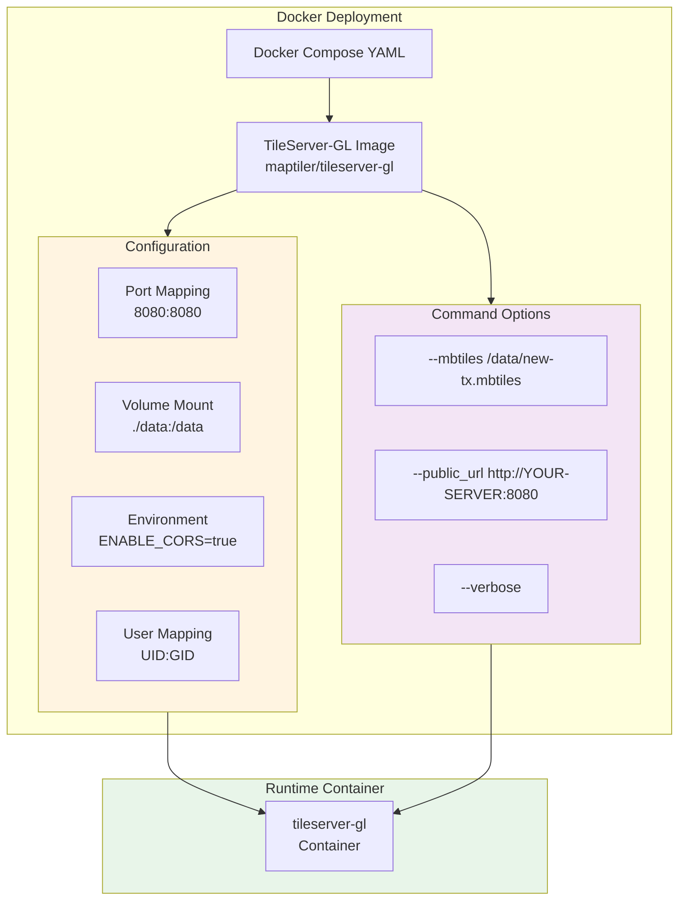

### Docker Compose Deployment
```bash
# Set user permissions
export UID=$(id -u)
export GID=$(id -g)

# Start the service
docker-compose -f tileserver-gl.yml up -d

# View logs
docker-compose -f tileserver-gl.yml logs -f

# Stop the service
docker-compose -f tileserver-gl.yml down
```

### Standalone Docker Deployment
```bash
docker run -d \
  --name tileserver-gl \
  -p 8080:8080 \
  -v $(pwd)/data:/data \
  -e ENABLE_CORS=true \
  maptiler/tileserver-gl \
  --mbtiles /data/new-tx.mbtiles \
  --public_url http://YOUR-SERVER:8080 \
  --verbose
```

### Verification
```bash
# Check if server is running
curl http://YOUR-SERVER:8080/

# Test vector tile endpoint
curl http://YOUR-SERVER:8080/data/new-tx/5/7/12.pbf

# Test raster tile endpoint
curl http://YOUR-SERVER:8080/styles/new-tx/5/7/12.png -o test.png

# Check style JSON
curl http://YOUR-SERVER:8080/styles/new-tx/style.json
```

[↑ Back to Top](#table-of-contents)

---

## Performance Characteristics

### Vector Tiles
- **Tile Size**: 10-50 KB per tile (compressed)
- **Rendering**: Client-side (GPU-accelerated)
- **Advantages**: 
  - Smooth rotation and tilting
  - Dynamic styling without re-downloading
  - Smaller data transfer
  - Higher quality at any zoom level

### Raster Tiles
- **Tile Size**: 15-80 KB per tile (PNG)
- **Rendering**: Server-side pre-rendering
- **Advantages**:
  - Wider client compatibility
  - No client-side processing required
  - Consistent appearance across all clients

### Caching Strategy
- Vector tiles: Cached in MBTiles database
- Raster tiles: Generated on-demand, can be cached by reverse proxy
- Font glyphs: Static files, highly cacheable
- Style JSON: Static, cacheable

### Resource Usage
- **Memory**: 100-500 MB (depending on concurrent requests)
- **CPU**: Low (vector serving), Medium-High (raster rendering)
- **Disk I/O**: Moderate (SQLite reads)
- **Network**: Local network only (YOUR-SERVER)

[↑ Back to Top](#table-of-contents)

---

## Scalability Considerations

### Horizontal Scaling

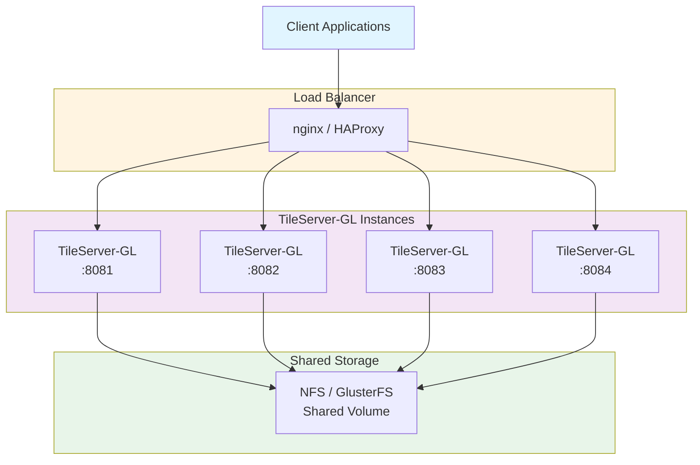

### Caching Layer (Optional)

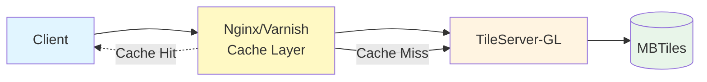

**Nginx Configuration Example**:
```nginx
proxy_cache_path /var/cache/nginx/tiles levels=1:2 keys_zone=tiles:10m max_size=10g;

location /styles/ {
    proxy_pass http://YOUR-SERVER:8080;
    proxy_cache tiles;
    proxy_cache_valid 200 30d;
    proxy_cache_key "$uri";
}
```

[↑ Back to Top](#table-of-contents)

---

## Security Considerations

### Network Security
- **Firewall**: Restrict port 8080 to internal network only
- **No Internet**: System operates completely offline
- **Access Control**: Use IP allowlist at firewall level

### Data Integrity
- **Read-only volumes**: Mount MBTiles as read-only in production
- **Checksums**: Verify MBTiles integrity with MD5/SHA256
- **Backups**: Regular backups of MBTiles database

### Container Security
- **User Mapping**: Run as non-root user (UID:GID mapping)
- **Resource Limits**: Set memory and CPU limits
- **No Privileged Mode**: Standard container permissions

[↑ Back to Top](#table-of-contents)

---

## Monitoring and Maintenance

### Health Checks
```bash
# Docker health check
HEALTHCHECK --interval=30s --timeout=5s --start-period=10s \
  CMD curl -f http://localhost:8080/ || exit 1
```

### Logging
```bash
# Access logs
docker logs tileserver-gl

# Verbose mode for debugging
--verbose flag enables detailed request logging
```

### Metrics to Monitor
- Request count per endpoint
- Response time (95th percentile)
- Error rate (4xx, 5xx)
- Memory usage
- Disk I/O wait time

### Backup Strategy
```bash
# Backup MBTiles database
cp /data/new-tx.mbtiles /backup/new-tx-$(date +%Y%m%d).mbtiles

# Backup configuration
tar -czf /backup/config-$(date +%Y%m%d).tar.gz /data/*.json /data/fonts/
```

[↑ Back to Top](#table-of-contents)

---

## Troubleshooting

```mermaid
graph TB
    A[Issue Detected]
    
    A --> B{Tiles Not Loading?}
    A --> C{Fonts Not Rendering?}
    A --> D{CORS Errors?}
    A --> E{Poor Performance?}
    
    B --> B1[Check TileServer logs<br/>docker logs tileserver-gl]
    B --> B2[Verify MBTiles exists<br/>ls /data/*.mbtiles]
    B --> B3[Test endpoint<br/>curl .../&#123;z&#125;/&#123;x&#125;/&#123;y&#125;.pbf]
    
    C --> C1[Check font directory mount<br/>ls /data/fonts/]
    C --> C2[Verify font names in style.json]
    C --> C3[Test font endpoint<br/>curl .../fonts/.../0-255.pbf]
    
    D --> D1[Check ENABLE_CORS=true]
    D --> D2[Verify browser console]
    D --> D3[Add reverse proxy headers]
    
    E --> E1[Enable caching layer<br/>nginx/varnish]
    E --> E2[Increase Docker memory]
    E --> E3[Use vector tiles<br/>instead of raster]
    E --> E4[Pre-generate tiles]
    
    style A fill:#ffebee
    style B fill:#fff4e1
    style C fill:#e1f5ff
    style D fill:#f3e5f5
    style E fill:#e8f5e9
```

[↑ Back to Top](#table-of-contents)

---

## Updating Data

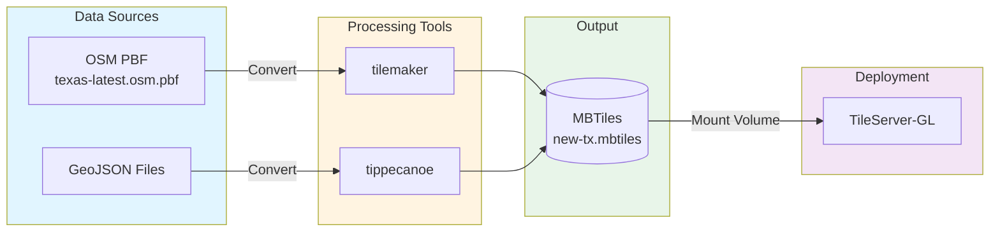

### Regenerating MBTiles
```bash
# Using tilemaker (OSM PBF → MBTiles)
tilemaker --input texas-latest.osm.pbf \
          --output new-tx.mbtiles \
          --config resources/config-openmaptiles.json \
          --process resources/process-openmaptiles.lua

# Or using tippecanoe (GeoJSON → MBTiles)
tippecanoe -o new-tx.mbtiles \
           -zg \
           --drop-densest-as-needed \
           --extend-zooms-if-still-dropping \
           input.geojson
```

### Updating Styles
1. Edit `style.json` with desired changes
2. Validate JSON syntax
3. Restart TileServer-GL container
4. Clear client-side cache if needed

[↑ Back to Top](#table-of-contents)

---

## Comparison: Vector vs Raster

| Feature | Vector Tiles | Raster Tiles |
|---------|-------------|--------------|
| **File Format** | PBF (Protocol Buffer) | PNG |
| **Rendering** | Client-side (WebGL/Canvas) | Server-side |
| **Tile Size** | 10-50 KB | 15-80 KB |
| **Styling** | Dynamic, client-controlled | Fixed, server-rendered |
| **Quality** | Resolution-independent | Fixed resolution |
| **Rotation/Tilt** | Smooth, 3D capable | Not supported |
| **Compatibility** | Modern browsers/apps | Universal |
| **Server Load** | Low | Medium-High |
| **Client Load** | Medium | Low |
| **Use Cases** | Interactive apps, mobile | Simple web maps, reports |

[↑ Back to Top](#table-of-contents)

---

## System Requirements

### Minimum Requirements
- **CPU**: 2 cores
- **RAM**: 2 GB
- **Disk**: 5 GB (MBTiles + fonts + overhead)
- **Network**: Local network access

### Recommended Requirements
- **CPU**: 4+ cores
- **RAM**: 4-8 GB
- **Disk**: 10+ GB (for logs, cache, multiple regions)
- **Network**: Gigabit LAN

[↑ Back to Top](#table-of-contents)

---

## License and Attribution

### Data Sources
- **OpenStreetMap**: © OpenStreetMap contributors, ODbL
- **OpenMapTiles**: BSD 3-Clause License
- **Fonts**: Noto Sans (Open Font License)

### Required Attribution
```
© OpenStreetMap contributors
Map tiles by TileServer-GL
```

[↑ Back to Top](#table-of-contents)

---

## Conclusion

This offline tile server architecture provides a robust, scalable solution for serving geospatial map data without internet dependency. It supports both modern vector-based rendering and traditional raster tiles, making it compatible with virtually any mapping application. The system is containerized for easy deployment, maintainable through standard DevOps practices, and performs efficiently for local/regional deployments.

[↑ Back to Top](#table-of-contents)

---

## Appendix A: Generating MBTiles with Tilemaker

This appendix provides a complete guide for generating MBTiles files from OpenStreetMap data using Tilemaker in a fully offline environment.

### Overview

Tilemaker is a tool that converts OpenStreetMap PBF files into vector tiles stored in MBTiles format. This process is essential for creating the tile database that TileServer-GL serves.

[↑ Back to Top](#table-of-contents)

---

### Offline Build Architecture

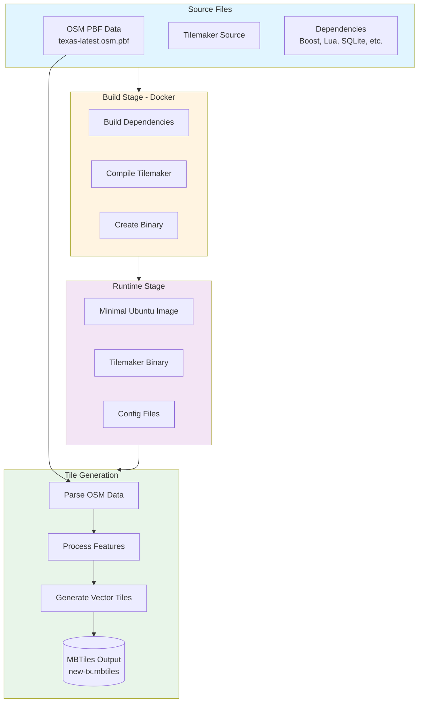

[↑ Back to Top](#table-of-contents)

---

### Dockerfile: Tilemaker Offline Build

This multi-stage Dockerfile creates a self-contained Tilemaker environment without requiring internet access during the build.

```dockerfile
# =============================================
# Tilemaker Offline Build Dockerfile - COMPLETE
# =============================================

# Stage 1: Builder
FROM ubuntu:22.04 AS builder

# Set working directory and prefix
WORKDIR /build
ENV PREFIX=/usr/local

# Install build tools
RUN apt-get update && \
    DEBIAN_FRONTEND=noninteractive apt-get install -y \
    build-essential \
    cmake \
    pkg-config \
    unzip \
    xz-utils \
    wget \
    tar \
    gzip \
    && rm -rf /var/lib/apt/lists/*

# Copy sources
COPY tilemaker/ /build/tilemaker/
COPY deps/ /build/deps/

# Build dependencies
WORKDIR /build/deps

# 1. Boost
RUN mkdir -p boost_build && \
    tar -xf boost/boost_1_81_0.tar.gz -C boost_build --strip-components=1 && \
    cd boost_build && \
    ./bootstrap.sh --prefix=$PREFIX && \
    ./b2 install

# 2. Lua
RUN tar -xf lua/lua-5.4.6.tar.gz && \
    cd lua-5.4.6 && \
    make linux test && \
    make INSTALL_TOP=$PREFIX install

# 3. SQLite3
RUN tar -xf sqlite3/sqlite-autoconf-3410200.tar.gz && \
    cd sqlite-autoconf-3410200 && \
    ./configure --prefix=$PREFIX && \
    make && make install

# 4. Shapelib
RUN tar -xf shapelib/shapelib-1.6.2.tar.gz && \
    cd shapelib-1.6.2 && \
    ./configure --prefix=$PREFIX && \
    make && make install

# 5. RapidJSON
RUN unzip rapidjson/rapidjson-master.zip -d rapidjson && \
    cp -r rapidjson/rapidjson-master/include/rapidjson $PREFIX/include/

# Build Tilemaker
WORKDIR /build/tilemaker
RUN mkdir build && cd build && \
    cmake .. \
    -DCMAKE_BUILD_TYPE=Release \
    -DCMAKE_INSTALL_PREFIX=$PREFIX \
    -DBOOST_ROOT=$PREFIX \
    -DSQLite3_INCLUDE_DIR=$PREFIX/include \
    -DSQLite3_LIBRARY=$PREFIX/lib/libsqlite3.so && \
    make -j$(nproc) && \
    make install

# Stage 2: Runtime
FROM ubuntu:22.04

# Copy binary and libraries
COPY --from=builder /usr/local/bin/tilemaker /usr/local/bin/tilemaker
COPY --from=builder /usr/local/lib/ /usr/local/lib/
COPY --from=builder /usr/lib/x86_64-linux-gnu/libstdc++* /usr/lib/x86_64-linux-gnu/
COPY --from=builder /usr/lib/x86_64-linux-gnu/libgcc_s* /usr/lib/x86_64-linux-gnu/

# Update linker and create config directory
RUN ldconfig && mkdir -p /etc/tilemaker

# Copy config files (if they exist in build context)
COPY tilemaker/config.json /etc/tilemaker/config.json
COPY tilemaker/process.lua /etc/tilemaker/process.lua

# Default command
ENTRYPOINT ["tilemaker"]
CMD ["--help"]

# Label
LABEL maintainer="Tile Server" \
      description="Tilemaker offline vector tile generator" \
      version="1.0"
```

[↑ Back to Top](#table-of-contents)

---

### Required Directory Structure

Before building, organize your files as follows:

```
tilemaker-build/
├── Dockerfile
├── tilemaker/
│   ├── src/
│   ├── include/
│   ├── CMakeLists.txt
│   ├── config.json          # OpenMapTiles config
│   └── process.lua          # Processing script
└── deps/
    ├── boost/
    │   └── boost_1_81_0.tar.gz
    ├── lua/
    │   └── lua-5.4.6.tar.gz
    ├── sqlite3/
    │   └── sqlite-autoconf-3410200.tar.gz
    ├── shapelib/
    │   └── shapelib-1.6.2.tar.gz
    └── rapidjson/
        └── rapidjson-master.zip
```

[↑ Back to Top](#table-of-contents)

---

### Build Process

```bash
# Navigate to build directory
cd tilemaker-build

# Build the Docker image
docker build -t tilemaker-offline:final .

# Verify the build
docker run --rm tilemaker-offline:final --help
```

**Expected Output**:
```
tilemaker 2.x.x
Usage: tilemaker [options] <input.osm.pbf>
Options:
  --output         Output .mbtiles file
  --config         Configuration JSON file
  --process        Lua processing script
  --store          Directory for intermediate storage
  --verbose        Verbose output
```

[↑ Back to Top](#table-of-contents)

---

### Generating MBTiles

#### Basic Command

```bash
docker run --rm \
  -v $(pwd)/data:/data \
  -v $(pwd)/store:/store \
  tilemaker-offline:final \
  /data/texas-latest.osm.pbf \
  --store /store \
  --config /etc/tilemaker/config.json \
  --process /etc/tilemaker/process.lua \
  --output /data/new-tx.mbtiles
```

[↑ Back to Top](#table-of-contents)

---

#### Processing Flow

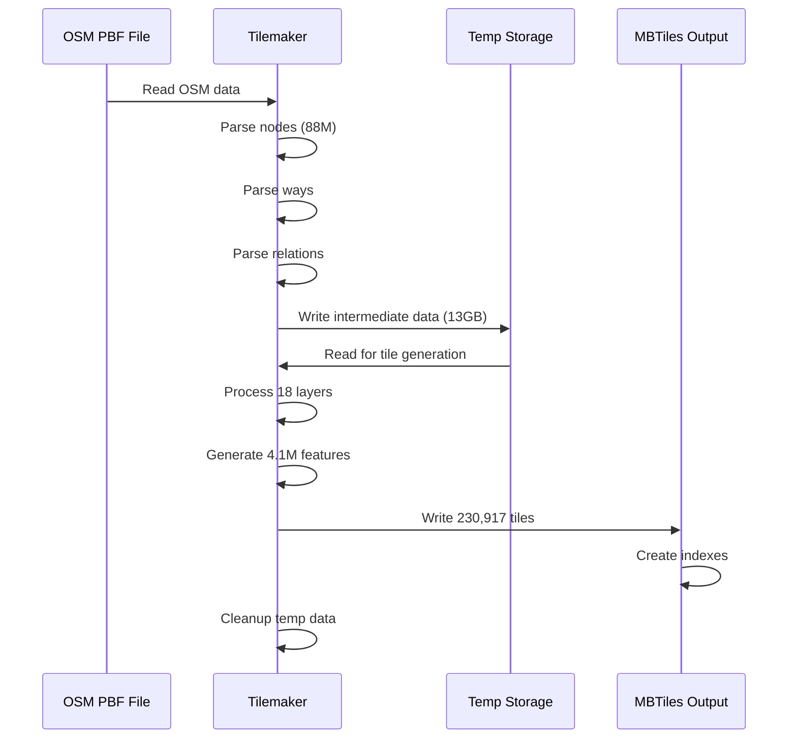

[↑ Back to Top](#table-of-contents)

---

#### Expected Output

```
Tilemaker v2.x.x

Reading OSM data...
- Nodes:     88,000,000 (88M)
- Ways:      12,500,000 (12.5M)
- Relations: 450,000

Processing layers...
✓ water
✓ waterway
✓ landcover
✓ landuse
✓ park
✓ boundary
✓ transportation
✓ building
✓ place
✓ housenumber
✓ poi
✓ aerodrome_label
✓ mountain_peak
... (18 layers total)

Generating tiles...
Zoom 0: 1 tile
Zoom 1: 1 tile
Zoom 2: 1 tile
...
Zoom 14: 170,989 tiles

Statistics:
- Total tiles: 230,917
- Total features: 4,100,000
- Output size: 592 MB
- Temp storage: 13 GB
- Time elapsed: ~45 minutes

✓ MBTiles created: /data/new-tx.mbtiles
```

[↑ Back to Top](#table-of-contents)

---

### Verification

#### 1. Check File Size and Type

```bash
ls -lh data/new-tx.mbtiles
file data/new-tx.mbtiles
```

**Expected Output**:
```
-rw-r--r-- 1 user user 592M Dec 27 10:30 new-tx.mbtiles
data/new-tx.mbtiles: SQLite 3.x database
```

#### 2. Inspect Tile Distribution

```bash
docker run --rm \
  -v $(pwd)/data:/data \
  tilemaker-offline:final \
  sqlite3 /data/new-tx.mbtiles \
  "SELECT zoom_level, COUNT(*) as tiles FROM tiles GROUP BY zoom_level ORDER BY zoom_level;"
```

**Expected Output**:
```
zoom_level|tiles
0|1
1|1
2|1
3|1
4|1
5|4
6|7
7|20
8|63
9|220
10|793
11|2995
12|11432
13|44389
14|170989
```

#### 3. Verify Metadata

```bash
docker run --rm \
  -v $(pwd)/data:/data \
  tilemaker-offline:final \
  sqlite3 /data/new-tx.mbtiles \
  "SELECT name, value FROM metadata;"
```

**Expected Output**:
```
name|value
name|Texas OpenMapTiles
format|pbf
bounds|-106.6456,25.8371,-93.5083,36.5007
center|-100.0770,31.1689,6
minzoom|0
maxzoom|14
attribution|© OpenStreetMap contributors
description|Vector tiles for Texas region
type|baselayer
version|3.0
```

#### 4. Extract Sample Tile

```bash
docker run --rm \
  -v $(pwd)/data:/data \
  tilemaker-offline:final \
  sqlite3 /data/new-tx.mbtiles \
  "SELECT tile_data FROM tiles WHERE zoom_level=10 AND tile_column=241 AND tile_row=401;" \
  > sample_tile.pbf

# Check tile size
ls -lh sample_tile.pbf
```

[↑ Back to Top](#table-of-contents)

---

### Performance Characteristics

#### Resource Usage

| Metric | Value | Notes |
|--------|-------|-------|
| **Input Size** | ~800 MB | texas-latest.osm.pbf |
| **Output Size** | ~592 MB | new-tx.mbtiles |
| **Temp Storage** | ~13 GB | Intermediate data |
| **RAM Usage** | 4-8 GB | Peak during processing |
| **CPU Cores** | All available | Parallel processing |
| **Processing Time** | 30-60 min | Depends on hardware |

#### Scaling by Region

| Region | OSM Size | Output Size | Processing Time |
|--------|----------|-------------|-----------------|
| Small City | ~50 MB | ~40 MB | 5-10 min |
| Large State (TX) | ~800 MB | ~600 MB | 30-60 min |
| Country (USA) | ~10 GB | ~8 GB | 6-12 hours |
| Continent (Europe) | ~30 GB | ~25 GB | 24-48 hours |

[↑ Back to Top](#table-of-contents)

---

### Optimization Tips

#### 1. Limit Zoom Levels

Reduce output size and processing time by limiting maximum zoom:

```bash
# Edit config.json
{
  "settings": {
    "maxzoom": 12  # Instead of 14
  }
}
```

**Impact**:
- Zoom 14 only: ~170K tiles (70% of total)
- Zoom 13-14: ~215K tiles (93% of total)
- Zoom 0-12: ~15K tiles (7% of total)

#### 2. Filter by Bounding Box

Process only a specific region:

```bash
# Add to config.json
{
  "settings": {
    "bbox": "-106.65,25.84,-93.51,36.50"  # West,South,East,North
  }
}
```

#### 3. Increase RAM Allocation

```bash
docker run --rm \
  --memory=8g \
  --memory-swap=16g \
  -v $(pwd)/data:/data \
  -v $(pwd)/store:/store \
  tilemaker-offline:final \
  ...
```

#### 4. Use SSD for Temp Storage

Mount `--store` directory on SSD/NVMe for faster I/O:

```bash
-v /mnt/fast-ssd/tilemaker-store:/store
```

[↑ Back to Top](#table-of-contents)

---

### Troubleshooting

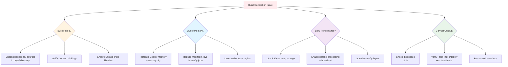

#### Common Issues

**Issue**: Build fails on dependency compilation
```bash
# Solution: Check that all source tarballs are present
ls -lh deps/*/
```

**Issue**: "Out of memory" during generation
```bash
# Solution: Increase Docker memory limit
docker run --memory=8g ...
```

**Issue**: Process killed unexpectedly
```bash
# Solution: Check system logs
dmesg | grep -i kill
# Usually indicates OOM killer - increase RAM
```

**Issue**: Tiles missing at certain zoom levels
```bash
# Solution: Check config.json zoom settings
cat config.json | grep -A5 settings
```

[↑ Back to Top](#table-of-contents)

---

### Integration with TileServer-GL

After generation, the MBTiles file is ready to use:

```bash
# Move to TileServer data directory
mv new-tx.mbtiles ./data/

# Start TileServer-GL
docker-compose -f tileserver-gl.yml up -d

# Verify tiles are accessible
curl http://localhost:8080/data/new-tx/0/0/0.pbf
```

[↑ Back to Top](#table-of-contents)

---

### Automation Script

Create a complete pipeline script:

```bash
#!/bin/bash
# generate-tiles.sh

set -e

REGION="texas"
OSM_FILE="${REGION}-latest.osm.pbf"
OUTPUT_FILE="${REGION}.mbtiles"

echo "=== Tilemaker Pipeline ==="
echo "Region: $REGION"
echo "Input: $OSM_FILE"
echo "Output: $OUTPUT_FILE"

# Create directories
mkdir -p data store

# Generate tiles
docker run --rm \
  --memory=8g \
  -v $(pwd)/data:/data \
  -v $(pwd)/store:/store \
  tilemaker-offline:final \
  /data/$OSM_FILE \
  --store /store \
  --config /etc/tilemaker/config.json \
  --process /etc/tilemaker/process.lua \
  --output /data/$OUTPUT_FILE \
  --verbose

# Verify output
echo "=== Verification ==="
docker run --rm \
  -v $(pwd)/data:/data \
  tilemaker-offline:final \
  sqlite3 /data/$OUTPUT_FILE \
  "SELECT zoom_level, COUNT(*) FROM tiles GROUP BY zoom_level;"

# Cleanup temp storage
rm -rf store/*

echo "=== Complete ==="
echo "MBTiles created: data/$OUTPUT_FILE"
ls -lh data/$OUTPUT_FILE
```

Usage:
```bash
chmod +x generate-tiles.sh
./generate-tiles.sh
```

[↑ Back to Top](#table-of-contents)

---

**End of Documentation**